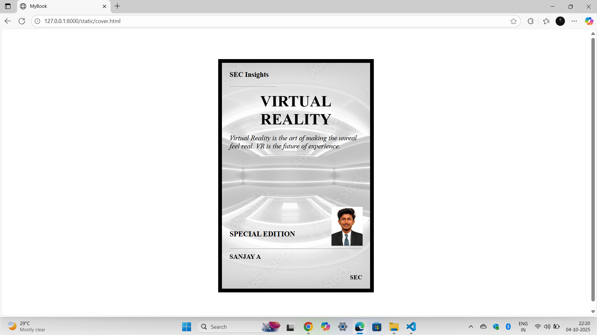

# Ex.06 Book Front Cover Page Design
## Date: 04.10.2025

## AIM:
To design a book front cover page using HTML and CSS.

## DESIGN STEPS:

### Step 1:
Create a Django Admin project.

### Step 2:
Create an app in the Django interface.

### Step 3:
Create a folder named 'static' in the app folder.

### Step 4:
Create a new HTML file in the static folder.

### Step 5:
Write the HTML code with relevant CSS properties.

### Step 6:
Choose the appropriate style and color scheme.

### Step 7:
Insert the images in their appropriate places.

### Step 8:
Publish the website in the LocalHost.

## PROGRAM:
```
<html>
    <head>
        <title>MyBook
        </title>
        <link rel="stylesheet" href="style.css">
    </head>
    <body>
        <div class="page">
            
            <div class="insights">
                SEC Insights
            </div>
            <div class="hr">
                <hr>
            </div>
            <div class="title">
                VIRTUAL REALITY 
                
            </div>
            <div class="subtitle">
              
              <i>Virtual Reality is the art of making the unreal feel real.
              VR is the future of experience.</i>
              
            </div>
            <div class="edit">
             SPECIAL EDITION
             </div>
             <br><hr>
              <div class="name">
                SANJAY A
                </div>
                <div class="bottom">
                    SEC
                </div>
            <div class="pic">
            </div> 
        </div>
    </body>
</html>

style.css

body{
    display: flex;
    justify-content: center;
    align-items: center;
    height: 100vh;
}
.page{
    width: 400px;
    height: 600px;
    background-image: url(virtual.jpeg) ;
    background-size: cover;
    background-repeat: no-repeat;
    background-position: center;
    border: 10px solid black ;
    padding:20px;
    box-sizing:border-box;
    background-clip: padding-box;
    position: relative;
}

.insights{
    font-size: 18px;
   font-weight: bold;
   margin-bottom: 20px;
}
.hr{
    color: white;
    width: 120px;
    right: 200%;
    

}
.title{
    font-size: 40px;
     margin: 13px 0 15px 0;
    
   font-weight: bold;
    text-align: center;
}
.subtitle{
    font-size: 18px;
    margin-bottom: 40px;
}
.edit{
    font-size: 19px;
    font-weight: bold;
    margin-top: 205px;
}
.name{
    font-size: 17px;
    font-weight: bold;
    margin-top: 10px;
   
}
.bottom{
    position: absolute;
    bottom: 20px;
    right: 20px;
    font-weight: bold;
}
.pic{
    position: absolute;
    bottom:110px;
    left: 74%;
    width: 100px;
    height:100px;
    background: url(photosanjay.jpg) no-repeat;
    background-size: 80px;

}
```

## OUTPUT:


## RESULT:
The program for designing book front cover page using HTML and CSS is completed successfully.
